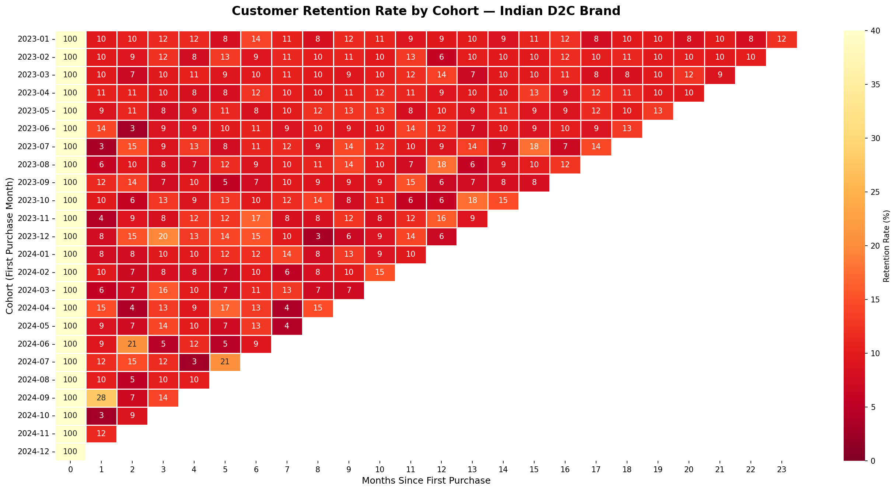
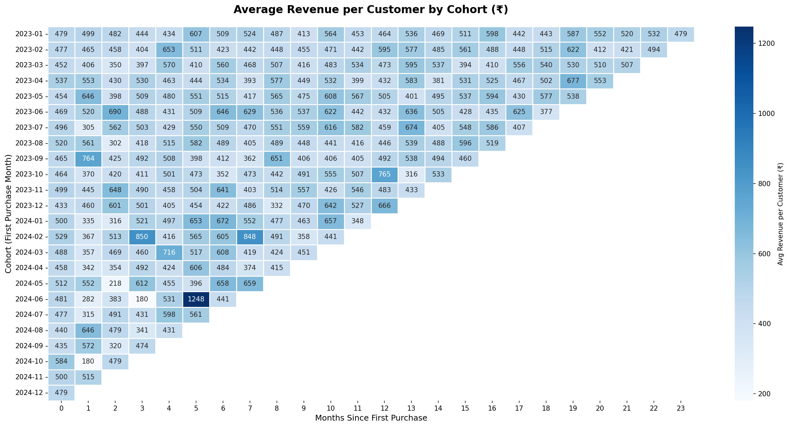

<h1 align="center">🛒 D2C Customer Cohort & Retention Analysis</h1>

<p align="center">
  
  
  
  
</p>

<p align="center">
  <b>Cohort analysis and retention modelling for Indian D2C brands</b><br>
  Simulated dataset | 3,000 customers | 8,000 orders | Jan 2023 – Dec 2024
</p>

---

## 📌 Business Problem

Indian D2C brands spend heavily on customer acquisition through
Instagram, Google, and influencer campaigns — but most don't know:

- 📉 When exactly do customers stop buying?
- 🏆 Which acquisition month brought the most loyal customers?
- 💰 What is the real lifetime value of a customer by cohort?

This project answers all three questions using **cohort analysis**
on simulated Indian D2C order data modelled around brands like
**The Whole Truth Foods**, **Nua**, and **Bombay Shaving Company**.

---

## 🛠️ Tools & Technologies

| Tool | Purpose |
|------|---------|
| Python (Pandas, NumPy) | Data simulation, cleaning, analysis |
| Matplotlib & Seaborn | Cohort heatmap visualisations |
| Power BI (DAX, Power Query) | Interactive business dashboard |
| Jupyter Notebook | End-to-end analysis environment |

---

## 📦 Dataset

> Simulated using Python to reflect realistic Indian D2C market patterns.
> City distribution, product mix, pricing, and acquisition channels
> based on publicly available information about the Indian D2C market.

| Parameter | Value |
|-----------|-------|
| Customers | 3,000 unique customers |
| Orders | 8,000 orders |
| Time Period | January 2023 – December 2024 |
| Product Categories | Nutrition, Skincare, Haircare, Pet Care, Wellness |
| Cities | Mumbai, Delhi, Bangalore, Pune, Hyderabad + more |
| Acquisition Channels | Instagram Ad, Google Ad, Organic Search, Referral, Influencer |

---

## 📊 Key Findings

### 1. 🔴 90% of customers are lost in Month 1
> **Average Month-1 Retention = 9.8%**

Only **1 in 10** new customers returns the very next month.
The first **30 days post-purchase** is the most critical retention window.

---

### 2. 📈 Month-3 retention is higher than Month-1
> **Month-3 Retention = 10.8%** vs **Month-1 = 9.8%**

Customers who don't return immediately come back at Month 2–3
when they finish the product — typical behaviour for consumables.

---

### 3. ⚡ Cohort quality varies by 10x
| Cohort | Month-1 Retention |
|--------|------------------|
| 🏆 Best — September 2024 | **27.9%** |
| ❌ Worst — October 2024 | **2.9%** |

Same brand. Same products. **10x difference** depending on
when customers were acquired.

---

### 4. ⚠️ Instagram creates channel concentration risk
> **Instagram Ads = 35.4% of all orders**

Heavy dependence on one platform is a significant business risk
if ad costs rise or algorithm changes.

---

### 5. 💳 Subscriber opportunity is underutilised
> **Subscribers = 25.4% of total revenue**

Subscriber vs non-subscriber avg order value is almost identical
(₹491 vs ₹493) — the subscription programme needs stronger incentives.

---

### 6. 🔄 Strong long-term repeat behaviour
> **Repeat Purchase Rate = 78.7%**

78.7% of customers purchased more than once over 2 years.

---

## 💡 Business Recommendations

| # | Recommendation | Impact |
|---|---------------|--------|
| 1 | Post-purchase email with 2nd-order discount at Day 21 | Fix Month-1 retention |
| 2 | Investigate & replicate September 2024 campaign | 3x retention potential |
| 3 | Invest in Referral & Organic Search channels | Reduce channel risk |
| 4 | Add 10–15% exclusive subscriber discounts | Increase subscriber LTV |

---

## 📈 Heatmap Previews

### Customer Retention Rate by Cohort


### Average Revenue per Customer by Cohort (₹)


---

## 📁 Project Structure

```
D2C-Cohort-Retention-Analysis/
│
├── 📂 data/
│   ├── orders_clean.csv
│   ├── orders_raw.csv
│   ├── customers_raw.csv
│   ├── customer_summary.csv
│   ├── retention_table.csv
│   └── revenue_table.csv
│
├── 📂 notebooks/
│   └── d2c_cohort_retention_analysis.ipynb
│
├── 📂 outputs/
│   ├── cohort_retention_heatmap.png
│   └── cohort_revenue_heatmap.png
│
├── 📂 dashboard/
│   └── d2c_dashboard.pbix
│
└── README.md
```

---

## 🎯 Target Startups

This analysis is directly applicable to:

| Brand | Category |
|-------|---------|
| The Whole Truth Foods | Health & Nutrition D2C |
| Nua | Women's Wellness D2C |
| Bombay Shaving Company | Men's Grooming D2C |
| Heads Up For Tails | Pet Care D2C |

---

## 👩‍💻 About

**Aprajita Dixit** — Data Analyst

[](https://www.linkedin.com/in/dixitaprajita/)
[](https://github.com/aprajitad)
[](mailto:dixitaprajita42@gmail.com)
